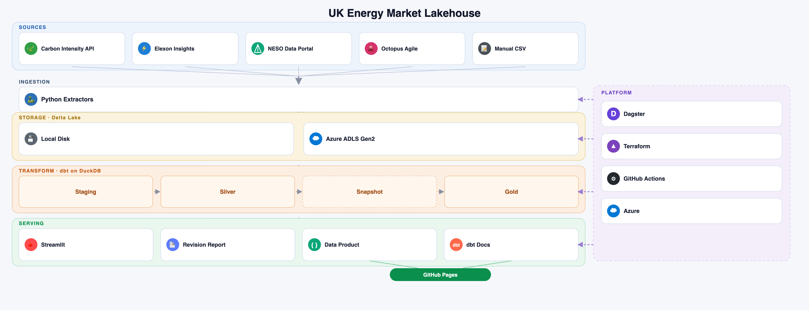

# UK Energy Market Lakehouse

A production-grade data engineering platform that ingests open UK energy data, transforms it through a medallion lakehouse, and serves it to dashboards and alerts. Built in personal time on personal equipment using free, public data.

The project has two aims: to demonstrate modern analytics engineering practice end to end (orchestration, lakehouse modelling, data quality, CI/CD), and to be genuinely useful, surfacing the cleanest and cheapest times to use electricity in my region.

## Status

Phase 1 is complete: a scheduled pipeline lands regional carbon intensity data every 30 minutes, transforms it through tested staging and silver models, and is guarded by continuous integration on every change.

Phase 2 is complete. Elexon ingestion and revision resolution are done for both system prices and generation by fuel type: bronze lands every settlement date, a weekly Dagster job re-downloads the trailing 28 days to catch anything that changes, and silver resolves each natural key to one trustworthy value with a full audit trail of every change observed. Bronze is Delta Lake, not plain parquet, and storage can point at either a local disk or a real Azure ADLS Gen2 account (provisioned by Terraform) via one environment variable. See the roadmap below.

## Architecture



Data flows from open APIs through Python extractors into a bronze, silver, gold medallion lakehouse, orchestrated by Dagster, transformed and tested by dbt, and served to dashboards.

## What works today

- Idempotent Python extractor for the Carbon Intensity API, landing bronze as a Delta table, one partition-scoped overwrite per data_date.
- Python extractors for Elexon system prices and generation by fuel type, at settlement-period grain, correctly handling the 46/50-period clock-change days (computed from the timezone database, not hardcoded). No API key needed; both are good citizens of the public API with a descriptive User-Agent, rate limiting, and backoff on errors.
- Elexon revision resolution, for both system prices and generation by fuel type: bronze is append-only for both (see [Why bronze never overwrites for Elexon](#why-bronze-never-overwrites-for-elexon) below), a weekly Dagster job re-downloads the trailing 28 days for each, and an incremental silver model resolves each natural key (settlement_date + settlement_period for prices; settlement_date + settlement_period + fuel_type for generation, since one row there is one fuel type within one period) to its latest-seen value, with a full audit table logging every change ever observed.
- Storage on Delta Lake, locally or on Azure ADLS Gen2 behind one `TARGET` switch (see [Local vs Azure storage](#local-vs-azure-storage) below) — atomic writes, a real transaction log, and time travel to query bronze as it stood before a revision landed.
- Infrastructure as code: `infra/terraform/main.tf` provisions the resource group, ADLS Gen2 storage account (hierarchical namespace on), and container, plus an Azure AD role assignment so the pipeline authenticates via the Azure CLI's cached login rather than a long-lived key.
- Dagster orchestration: carbon intensity runs as a scheduled asset every 30 minutes; the two Elexon sources re-download weekly, staggered 30 minutes apart. All three have a blocking asset check that validates the landed data.
- dbt transformations on DuckDB: staging models that read bronze Delta tables via `delta_scan()`, type and clean the raw data, and silver models that resolve each source to one trustworthy row per natural key.
- Data quality: dbt tests (not null, uniqueness of a column combination, accepted values, range checks via dbt-expectations, and custom tests asserting resolved values trace back to a real bronze row and that revision counts stay sane) covering the models. Dedicated pytests also exercise the revision-resolution SQL idiom directly against synthetic data for both Elexon sources, independent of dbt.
- Continuous integration: GitHub Actions runs linting, unit tests, and a full dbt build against committed sample fixtures — small Delta tables, not flat parquet files, including a synthetic revision scenario for each Elexon source — on every push and pull request.

## Tech stack

Python, Dagster (orchestration), Delta Lake with DuckDB's `delta` extension (storage and query), dbt with DuckDB (transformation and testing), Azure ADLS Gen2 with Terraform (cloud storage and infrastructure as code), GitHub Actions (CI), uv (packaging and environments). Power BI and Streamlit arrive in Phase 3.

## Data sources

All free and public.

- Carbon Intensity API: regional generation mix and carbon intensity, half-hourly with a 48-hour forecast. In use now.
- Elexon Insights (BMRS): wholesale prices, generation by fuel type, balancing. Public, no key required. Phase 2.
- NESO Data Portal: demand forecasts, interconnector flows, and the transmission connections queue. Later phases.

## Repository layout

```
src/lakehouse/        Python: extractors, io/storage (local vs Azure), Dagster definitions, alerts
dbt/                  dbt: staging, silver, (gold to come), tests, macros (bronze() local/Azure switch)
tests/                pytest unit tests and CI fixtures (Delta tables)
.github/workflows/    CI pipeline
infra/terraform/      Resource group, ADLS Gen2 storage account, container, RBAC role assignment
apps/                 Streamlit dashboard (from Phase 3)
```

## Why bronze never overwrites for Elexon

Carbon Intensity's bronze extractor overwrites the same file when re-run for a date it has already landed: that data source has no concept of revision, so the latest fetch is always the correct fetch, and idempotent overwrite is the simpler, correct design.

Elexon is different, for both system prices and generation by fuel type. Elexon can revise a published value after the fact, so a value fetched today is not guaranteed to still be the current value next week. If bronze overwrote on every re-download, the earlier value would be gone before anything downstream could notice it had changed. So bronze is append-only for both: every write uses `mode="append"` on the Delta table, which only ever adds rows and never replaces or removes one, and a weekly Dagster job re-downloads the trailing 28 days for each, specifically to catch anything that changed since the last landing. Nothing is ever deleted from bronze; silver is where a single trustworthy value gets picked out of however many landings exist for a given key. Carbon Intensity, in contrast, uses `mode="overwrite"` scoped to the one data_date being re-landed (a `predicate` on the write, matching Delta's partitioning) — idempotent by design, and every other date already in the table is left untouched.

**One correction to how this is usually described.** The standard explanation of Elexon settlement is that a value is published as an early estimate and then corrected over a formal reconciliation calendar spanning weeks to months (II → SF → R1 → R2 → R3 → RF, the last one landing roughly 14 months after the settlement date). Before building the resolution logic, this was checked directly against the live API rather than assumed, for both sources: `/balancing/settlement/system-prices/{date}` and `/datasets/FUELHH` were both queried for settlement dates 1 day, 2.5 months, 7 months, and 15 months old, and in every case `createdDateTime` / `publishTime` sat within about a day of the original settlement date, with no trace of the later reconciliation runs touching either. Neither endpoint exposes a settlement-run-type field at all, so there is nothing to rank a "most authoritative run" against on either source, only `loaded_at`.

The practical upshot: both endpoints appear to reflect only the fast initial settling (within roughly a day of the settlement period), not the multi-month reconciliation cycle that applies to metered volumes elsewhere in BSC settlement. The design above (bronze keeps everything, weekly re-download, resolve on latest `loaded_at`) is still the right architecture regardless — it costs one extra weekly pass over a bit more history, and it is what would catch a later revision if either endpoint's behaviour is ever wrong or changes. But expect `silver__price_revisions` and `silver__generation_revisions` to be sparse or empty most weeks. That is the healthy state for these data sources, not a sign the pipeline is broken.

## Local vs Azure storage

Every extractor and every dbt staging model goes through `src/lakehouse/io/storage.py` rather than building a path or a credential itself, so there is exactly one place that knows the difference between local and Azure. Two functions: `table_uri(layer, name)` resolves where a table lives, `storage_options()` resolves how to authenticate to it. Both read one environment variable, `TARGET`, set in `.env`:

- **`TARGET=local`** (the default): tables live under `LOCAL_DATA_ROOT` (default `data`) as plain directories on disk — each one a real Delta table (parquet files plus a `_delta_log/` of JSON commits), not a bare parquet file. No credentials needed.
- **`TARGET=azure`**: tables live in the ADLS Gen2 container Terraform created, addressed as `abfss://<container>@<account>.dfs.core.windows.net/bronze/<name>`.

**Credentials, in order of preference:**
1. **Azure CLI identity** (the default): `storage_options()` returns `{"azure_use_azure_cli": "true", ...}`, and `deltalake`'s own Rust-native Azure client shells out to your cached `az login` session for a token on every write or read. Nothing secret ever touches disk. This is backed by the `Storage Blob Data Contributor` role `infra/terraform/main.tf` assigns to your signed-in identity, and it is the answer you want to be able to give in an interview.
2. **Account key fallback**: if `AZURE_STORAGE_ACCOUNT_KEY` is set in `.env`, it is used instead. Get it with `az storage account keys list --account-name <name> --query "[0].value" -o tsv`. This works reliably even if the CLI path misbehaves, but it is a long-lived secret sitting in a file — a stopgap, not the default.

Both paths were verified against the real Terraform-provisioned storage account, not just locally: a table was written, read back, and deleted again through `azure_use_azure_cli` before this was trusted.

**One thing this is not:** `deltalake` does not go through `adlfs` (an fsspec library) to talk to Azure. It has its own built-in Azure client and only recognises its own `azure_*`-prefixed option keys (`azure_storage_account_name`, `azure_use_azure_cli`, etc. — pulled directly from the compiled library rather than assumed, since the option names are easy to get subtly wrong). `adlfs` and `azure-identity` are still project dependencies but currently unused by anything the pipeline writes or reads; they were added ahead of settling on this design and may be useful later for something that specifically wants fsspec-style access.

**A schema gotcha worth knowing about:** Carbon Intensity's `intensity_actual` column is `None` for every row (the regional API is forecast-only). A pandas column that is `None` in every row has no non-null value for pyarrow to infer a concrete type from, so it gets typed as Arrow's `null`/void type — and DuckDB's `delta_scan()` (and most other Delta readers) reject void-typed columns outright. `carbon_intensity.py` now force-casts that column to `float64` before it ever reaches `write_deltalake`, rather than leaving it to type inference. This was caught by actually running `delta_scan()` against a real written table, not by reading the `deltalake` or DuckDB docs — worth remembering if a future column is ever all-null in a real fetch.

**dbt has the same local/Azure split, as its own `--target` flag.** `profiles.yml` defines two dbt targets, `local` and `azure`, each pointing at its own DuckDB file (`lakehouse.duckdb` / `lakehouse_azure.duckdb` — deliberately separate, see below). Every staging model reads bronze through one macro, `macros/bronze.sql`, the dbt-side equivalent of `table_uri()`: it switches on `target.name` and resolves to `delta_scan('<local path>')` or `delta_scan('abfss://...')`. `read_parquet()` is never used over a Delta directory anywhere in this project: files Delta has logically deleted are still physically present until a vacuum runs, so `read_parquet()` would silently include rows the table no longer contains — exactly the class of silent wrongness this whole project exists to catch.

- `local` target: `extensions: [delta]`, no credentials, same as always.
- `azure` target: `extensions: [delta, azure]`. DuckDB's `azure` extension is a *different* Rust crate from `deltalake`'s own Azure client, with its own separate credential resolution — the two don't share a credential path just because both say "Azure CLI." This was a real, reproduced failure, not a theoretical one: with an unpinned credential chain, `delta_scan()` tried the Azure Instance Metadata Service (managed identity) first, retried it ten times, and never got to the CLI credential at all. Fix: `profiles.yml`'s `secrets:` block pins `chain: cli` explicitly, so there is exactly one credential source, named, not a chain of fallbacks. `settings: azure_transport_option_type: curl` is also set, for a cross-platform HTTP transport rather than a platform-default one.
- **Why separate DuckDB files per target, not one shared file:** tried sharing one first. Silver's incremental models merge into whatever table already exists rather than rebuilding from scratch, so running `--target local` (90 days of bronze) and then `--target azure` (bronze with far less history landed so far) against the *same* file left 90 days of resolved rows from local bronze sitting in `silver__system_prices` with no matching row in Azure's bronze — and `resolved_values_match_bronze_source` correctly failed loudly on around 4,300 of them. That is the test doing its job, not a bug in the test. Separate files mean each target's incremental state can only ever reconcile against its own bronze, which is what "two independent environments" has to actually mean.

Both targets were run for real, not just described: `cd dbt && uv run dbt build --target local` and `--target azure` each pass all 56 tests, the azure one reading live data out of the real ADLS container.

## CI's own Azure access

CI is cloud-free by default: the `build` job (lint, unit tests, `dbt build` against committed fixtures) runs on every push and every pull request, including from forks, with no Azure credentials anywhere in reach.

A separate `azure` job runs `dbt build --target azure` and `terraform plan` against the real subscription, but only on push to `main`, never on `pull_request`. That's deliberate, not an oversight: this is a public repo, and a fork's PR runs with that PR's own (possibly modified) workflow file, so granting cloud credentials on `pull_request` would let any external contributor author a step that uses them. Push to `main` only runs code that has already been merged and is already trusted.

Authentication is OIDC via `azure/login`, backed by an `azuread_application_federated_identity_credential` (`infra/terraform/main.tf`) whose subject claim is pinned to `repo:<owner>/<repo>:ref:refs/heads/main`. There is no client secret anywhere in this chain for a leaked repo secret to expose, on either side — GitHub mints a short-lived OIDC token per run, Azure trusts it because the subject matches, and that's the whole credential. The three values in `AZURE_CLIENT_ID` / `AZURE_TENANT_ID` / `AZURE_SUBSCRIPTION_ID` (GitHub repo secrets) aren't sensitive on their own — they identify the app, they don't authenticate as it — they're kept as secrets anyway purely because that's the universal convention for `azure/login`'s inputs.

CI's identity gets the same `Storage Blob Data Contributor` scope as the human identity above (data-plane only, on the storage account), plus `Reader` on the resource group for `terraform plan` — deliberately not `Contributor`: plan only needs to read current state to compute a diff, it never creates or changes anything.

## Budget alert

`infra/terraform/main.tf` provisions an `azurerm_consumption_budget_subscription` at £1.50/month with two notifications, at 80% and 100% of actual spend, both emailing the account owner. This is the actual cost tripwire for the whole project, not a manual step to remember: it's created and destroyed along with everything else by `terraform apply` / `make teardown`.

## Running it locally

Prerequisites: Python and [uv](https://docs.astral.sh/uv/).

```bash
# install dependencies and the project itself
uv sync

# fetch some data (TARGET defaults to local -- creates data/bronze/... on first run)
uv run python -m lakehouse.extractors.carbon_intensity --date 2026-08-06
uv run python -m lakehouse.extractors.elexon_system_prices --start-date 2026-05-18 --end-date 2026-08-15
uv run python -m lakehouse.extractors.elexon_generation_by_fuel --start-date 2026-05-18 --end-date 2026-08-15

# run the orchestrator UI (persists run history to .dagster_home/)
make dev
# then open http://localhost:3001

# build and test the transformations
make dbt-build
```

To land against the real Azure storage account instead of local disk, `export TARGET=azure` (or set it in `.env`) before running an extractor -- see [Local vs Azure storage](#local-vs-azure-storage) above. `az login` needs to be current; nothing else changes.

To build and test against Azure-hosted bronze instead of local: `make build-azure` (plain `make dbt-build` / `make build-local` stay pointed at local). `TARGET` (what the Python extractors read) and dbt's `--target` (what these two make targets set) are independent switches -- `make build-azure` sets both together so a run is internally consistent, but landing data with the Python extractors and building with dbt are still two separate commands, so it is possible to point them at different places by accident. If dbt's numbers look wrong, check both are pointed at the same place before anything else.

If `uv run python -m lakehouse...` fails with `ModuleNotFoundError: No module named 'lakehouse'`, the editable-install `.pth` file has had macOS's hidden flag set on it again (a recurring quirk in this environment, not a real packaging bug): run `chflags nohidden .venv/lib/python3.12/site-packages/*.pth` and retry. `make dev` clears this automatically before every launch; `make dbt-build`/`make dbt-deps` don't need it, since dbt itself never imports the `lakehouse` package.

## Roadmap

- Phase 2 remaining: a `make teardown` target to `terraform destroy` on demand; and once a real Elexon revision has actually been captured in the wild (not just the synthetic fixture scenario), a small script showing the same settlement period at two Delta table versions with different prices, using Delta's time travel -- the actual "my pipeline noticed the official price changed" demo.
- Phase 3: dimensional gold models, published dbt docs, a Power BI dashboard, and a personal Streamlit dashboard reachable on mobile.
- Phase 4 and uniqueness layer: NESO demand forecast accuracy, a connections-queue observatory built on the public TEC register, published analysis of price revisions, a small public data product, and a personal dynamic-tariff cost comparison.

## Notes

All data are open public data. Source data remains under each provider's own open data terms.

## License

MIT (see LICENSE).